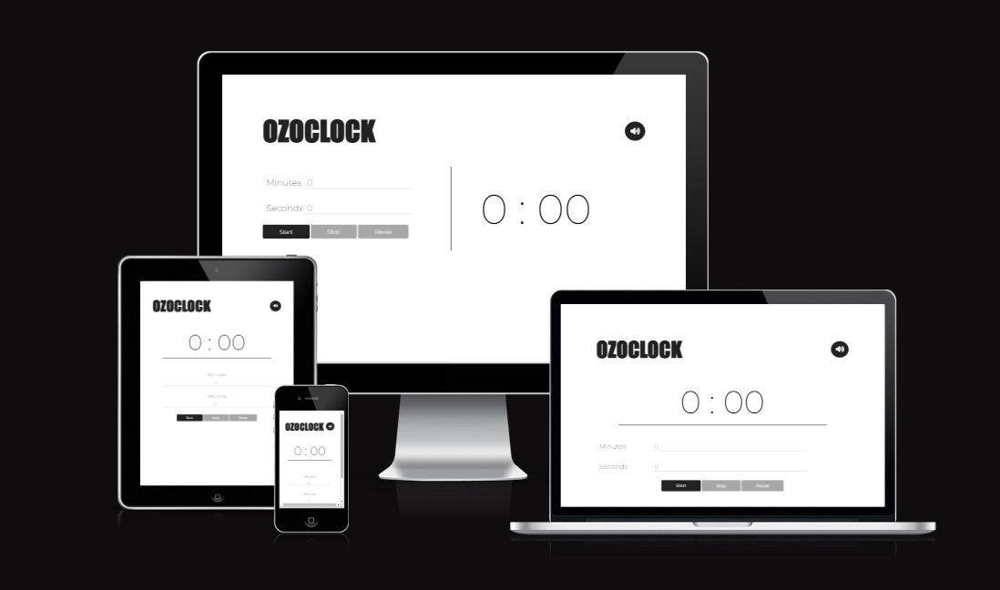
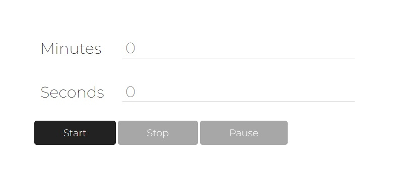
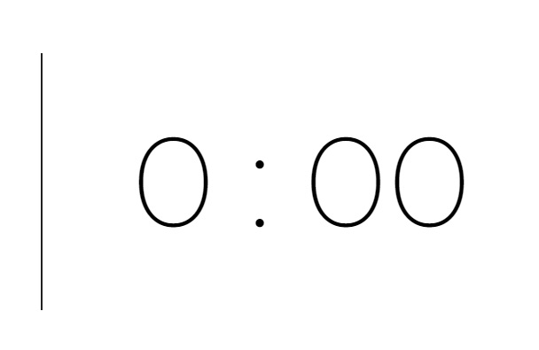

# OzoClock Alarm

The Ozoclock is a simple alarm that allows you to set a specific time period of up to 300 minutes. The alarm has the classic old-fashioned sound and there is the usual ticking sound of clocks which you can turn off if you want from the mute button at the top of the screen.

Live Link: https://omergamil.github.io/ozoclock/

## User Experience - UX

### Strategy

I wanted to make a very simple alarm clock that would help people set a small time period of no more than 300 minutes. 
The Clock should be as simple as possible so that anyone can understand its function without any effort.

>The project has no prospective client, it is built for fun and engagement and learning purposes.

__User Stories__
- I want to be able to understand the functionality of the site.
- I want to be able to set a small period easy and fast.
- I want to be able to see the remaining time clearly.
- I want to be able to know if the time period is up with an alarm sound.
- I want a simple and good looking design.

__User Goals__
 - Set a time period fast and easy.
 - Get notified when the time period is up.

 __Site Owner Goals__
 - Create a very simple alarm clock.
 - Design the clock to be simple and good looking.
 - The site is responsive and easy to navigate.

### Scope

This took a bit of time in figuring out, it was a continuous development in this as I progressed in my javascript learning. The initial setting is to have one single page with all the buttons and the clock, so what this page has to have is:

- The Logo: simple beautiful logo on the top left corner.
- Mute button: a mute button in the top right corner to mute the ticking sound if needed.
- Input fields: two input field for setting the minutes and seconds.
- Start, Stop, Pause Buttons: Three buttons for starting and stopping the Clock when needed.
- Clock numbers: numbers to show the remaining time.

### Structure

The Clock didn't need more than one page, only three buttons were always shown in the bottom area, the inputs were above the buttons, the logo and mute button were always at the top opposite each other, and the counter was shown in the largest possible size with some changes depending on the device used.

## User  Interface - Surface

### Typography

The logo font was an original custom font made by me. Montserrat font for the rest of the site was taken from Google Fonts.

### Colors

Color Scheme were simple black and white color palette.

## Features 

- __Header__

    - The header is featured at the top of the page, and contains the Logo of the alarm and the mute button.
    - The mute button is used to mute the ticking sound if needed.

- __Controls__

    - The control section is where the user will be able to set his alarm for the specified time and to start, stop or pause the timer.
    - Once the user has set the period it will be displayed in the Counter.

- __The counter__

    - In the counter there will be the numbers of the minutes and seconds displayed separated by a colon.
    - When the alarm first loads it will display "0:00".
    - Once the user has set the period needed from the controls then the counter will change accordingly.

## Accessibility

1. All html pages use semantic HTML headings.
2. Aria-labels are used where necessary (label, inputs)
3. Color-contrast for foreground and background meet WCAG standard guidelines.

## Technologies Used

### Languages

- HTML5
- CSS3
- JavaScript

### Other Sites and Softwares

- [Github](https://github.com/) - For version control and deployment.
- [Font Awesome](https://fontawesome.com/icons) - For icons in the footer, magic wand and timer challenge.

## Testing and Validation 

### Testing 

- Multiple devices where used to test the fuctionalities of the site:

  - PC: Hp pavilion windows 10, Runnning Chrome, Opera or FireFox, 27" monitor (1920x1080).
  - Phone: Iphone 14 pro, Running Chrome, 6.1" display (2532x1170).

- I tested the buttons and they are freezing when the counter starts.
- I tested the inputs and they have limits when typing more than 300 for minutes and 59 for seconds.
- I tested mute button and it mutes the ticking sound directly after clicking it.
- I tested the responsiveness of the website and it is responsive till 280px screen width.

### Validation

- HTML
    - For validating the HTML code of the Alarm the official [W3C Validator](https://validator.w3.org/) was used.

- CSS
    - For validating the CSS code of the Alarm the official [Jigsaw Validator](https://jigsaw.w3.org/css-validator/) was used.

- Javascript
    - For validating the JavaScript code of the Alarm the official [JSHint](https://jshint.com/) was used.

#### HTML Validation

- W3C Validator 
    - The HTML for the Alarm has no errors.

#### CSS Validation 

- JigSaw Validator
    - The CSS for the Alarm has no errors or warnings.

#### JavaScript Validation 

- JSHint Validator 
    - The JavaScript for the game had no errors.
        - The following metrics were returned:
            - There are 18 functions in this file.
            - Function with the largest signature take 2 arguments, while the median is 0.
            - Largest function has 13 statements in it, while the median is 4.- The most complex function has a cyclomatic complexity value of 8 while the median is 1.

## Deployment

The OzoClock Alarm was deployed to [GitHub](https://github.com/) pages.

The live link can be found here: https://omergamil.github.io/ozoclock.github.io/

## Credits 

### Acknowledgement

I'd like to give a Great Thamks to Spencer Barriball, my mentor at Code Institute, for giving me valuable guidance and support throught the duration of this project.

### Media

- [Favicon](https://favicon.io/) was used to source the fav-icon for the tab.
